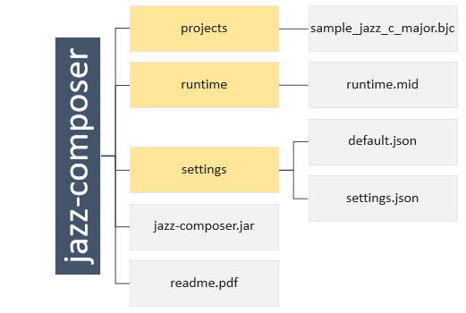
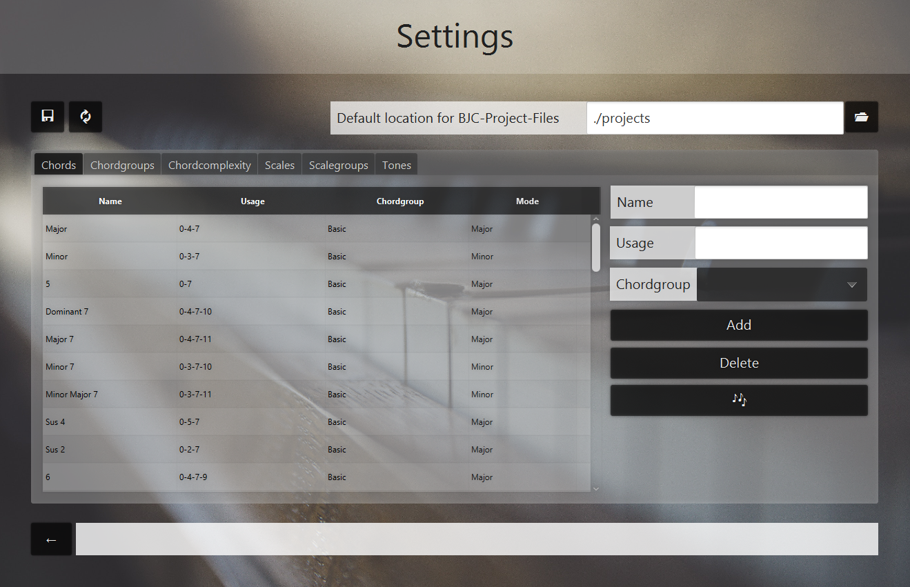
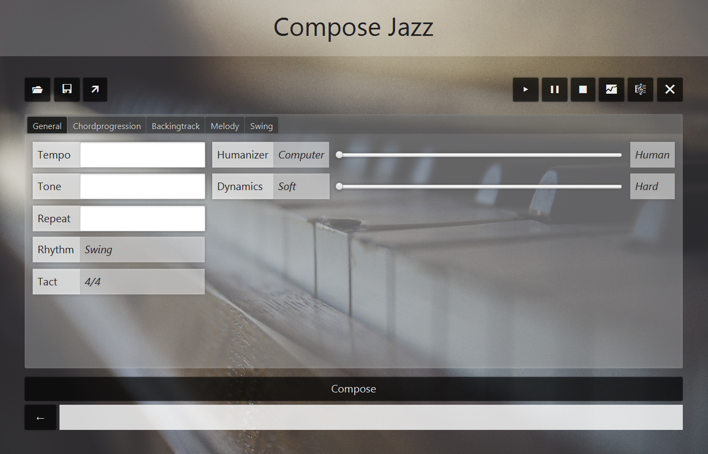
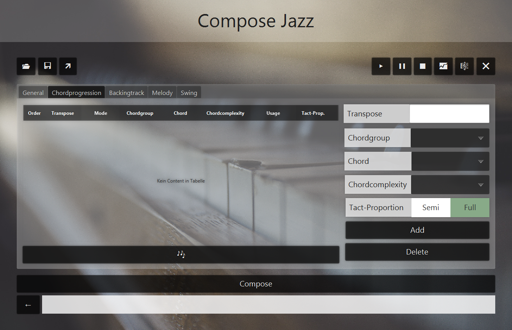
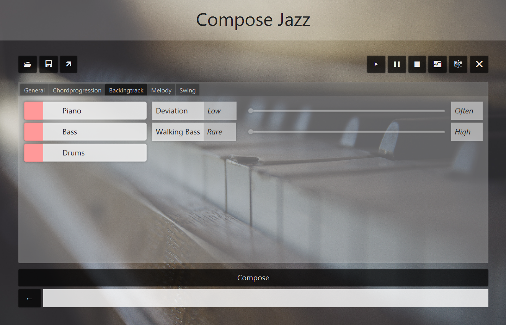
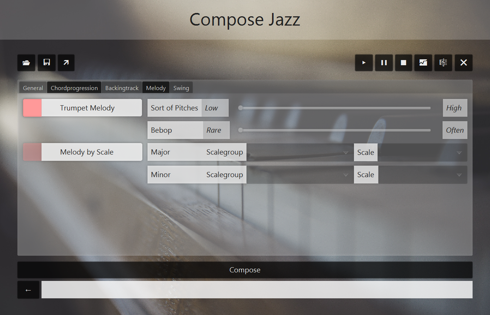
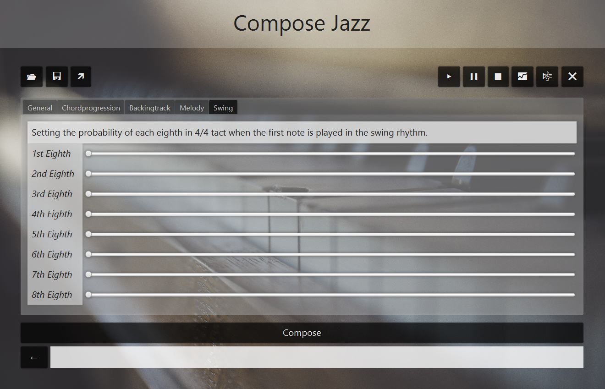

# jazz-composer
Java application to compose jazz music.

## 1. Used libraries
- [JMusic](http://explodingart.com/jmusic/)
- [JSON-Simple](https://github.com/fangyidong/json-simple)

## 2. Getting started

### 2.1 Install the application

Download the ZIP-file under 'release' and unzip it.

### 2.2 Start the application

For the most error-free use of the application, you should have a structure with directories (yellow) and files (white) as shown in Figure 1.

*Figure 1 - Structure of application directories and files*

The projects directory contains BJC-specific (BJC = Barnickel Jazz Composer) files. The runtime directory contains files that are used at runtime of the application. This currently only affects the runtime.mid file. This will be used to play, pause or stop composing music in the application at runtime. The settings directory contains settings files. Here it is possible to make specific settings in the application. However, the default settings can be reloaded at any time.
Now double click on the file jazz-composer.jar to start the application.

### 2.3 The menu

By starting the _jazz-composer_, you'll reach at first the menu (Figure 2). From here you have different options:
- Manage settings in `⚙`.
- Create a Jazz-Composition in `Compose Jazz`.
- Show information about the project in `About`.

*Figure 2 - The menu*

### 2.4 The settings

Manage chordgroups, scalegroups including there chords and scales. Set chordcomplexities and tones including there pitches. You can use this musicstructures for the later jazz-composing.
Save the settings by clicking on `💾` or pressing `Ctrl` + `S`.
Load the default-settings by clicking on `🔃`.
Set the default folder for project-files by clicking on `📂`. Initially this is the directory 'projects'.

*Figure 3 - The settings*

You can play chords, scales and pitches by selecting an item in a table and click on `🎶`. Add, change and delete items.

## 3. Composing Jazz-Music

### 3.1 Create Backingtrack

Open a BJC-Project-File by clicking `📂`. 
Save the current composition as BJC-Project-file by clicking on `💾`. 
Export the current composition as MIDI-file by clicking on `🡵`. 
Play the current composition by clicking on `▶`.
Pause the current composition by clicking on `∎∎`.
Stop the current composition by clicking on `⏹`.
View *JMusic*-Statistics of current composition by clicking on `📈`.
View the current composition as *JMusic-Project* by clicking on `🎼`.
Clear the current composition by clicking on `❌`.

Click on Compose Jazz in the menu to automatically compose jazz music. For this you have to make different settings. These include general settings (Figure 4) in which you set the tempo (Tempo), the tone (Tone) and the number of repetitions of the later set pattern (Repeat). You can also set the humanity factor (Humanizer) and the dynamics (Dynamics).
The composition will be composed in *Swing* and *4/4*-Tact.

*Figure 4 - General settings*

In the Chord Progression section (Figure 5), you can specify a chord progression. Here you can select your own harmony groups (chord group) and a chord available in it. The Transpose key (transpose) allows you to specify the chord in relation to the root in semitone steps. The chord complexity (Chord Complexity) indicates in which complexity range the chord should be generated.

*Figure 5 - Chordprogression settings*

Also, the clock proportion (Tact Proportion) can be set between Semi and Full. Semi is a half measure (2 beats) and Full is a whole measure (4 beats). By clicking on the notes, a selected pattern element can be heard as a test. Pattern elements can be deleted, changed or added.

In the Backing Track section (Figure 6) settings can be adjusted for accompaniment of the composition. This includes the selection of the appropriate instruments (piano, bass and drums). With the help of the Slider Deviation it can be set to what extent the smallest possible difference of the fundamental tone should be generated with successive chords. The walking-bass slider adjusts the likelihood of a bar being played in the walking-bass style with respect to the bass instrument.

*Figure 6 - Backingtrack settings*

In the Melody section (Figure 7) melody-specific settings can be made. For this you can activate the melody first. With the slider Sort of Pitches you can set the probability, whether the pitches are played in one bar up or down. The likelihood of a bebop playing style can also be adjusted with the slider bebop. With the activation of Melody by Scale you can set whether the melody should be generated on the chord progression or on scales defined here. Here, a distinction is made between the setting of major and minor scales. The melody is played by a trumpet.

*Figure 7 - Melody settings*

In the last section, Swing (Figure 8), the likelihoods of each eighth can be set in the swing rhythm as a start to the measure. These effects apply to both the piano and the trumpet (Melody).

*Figure 8 - Swing settings*

By clicking on Compose below, jazz music can be composed after successful configuration. This is automatically created in the default directory as a MIDI file runtime.mid and overwritten if necessary. Use the buttons in the upper left corner to load or save project files (BJC files [BJC = Barnickel Jazz Composer]). The button with the arrow to the top right allows the explicit export of the current composition as a MIDI file.
With the buttons on the top right, current compositions can be listened to, paused or stopped. The fourth button with the graph provides a statistical insight into the composition in terms of pitch, tone duration (Rhythm Value), dynamics (Dynamic) and other criteria. The button with the clef allows a detailed view of all tonal values ​​of the instruments in the current composition. By clicking on the X at the top right all settings regarding the current composition are reset. Unsaved data is lost here.
The application is a non-real-time environment. Thus, after each change you have to compose again with the click on Compose in order to hear the current result.

Create Backingtrack by clicking on `Compose`.

## 4. Loading a test composition

The projects directory contains a BJC project file sample_jazz_c_major.bjc. This can be loaded in Composer top left by clicking on the button with the folders. Then you can generate a composition by clicking on Compose.

## 5. About

Development: Philipp Barnickel

Review: Prof. Dr. Eckhard Kruse