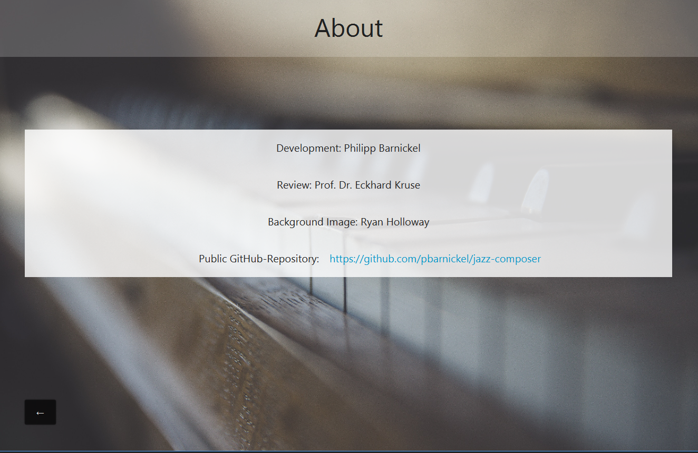

# jazz-composer
Java application to compose jazz music.

## 1. Used libraries
- [JMusic](http://explodingart.com/jmusic/)
- [JSON-Simple](https://github.com/fangyidong/json-simple)

## 2. Getting started

### 2.1 The menu

Wenn Sie den _jazz-composer_ starten, gelangen Sie zunächst in das Menü. Hier haben Sie verschiedene Optionen:
- Manage settings in `⚙`
- Create Jazz-Backingtrack in `Create Backingtrack`
- Show informations about the project in `About`

### 2.2 The settings

Manage chordgroups, scalegroups including there chords and scales. Set chordcomplexities. You can use this musicstructures for the later jazz-composing.
Save the settings by clicking on `💾`.
Load the default-settings by clicking on `🔃`.
Set the default folder for project-files by clicking on `📂`.

## About

