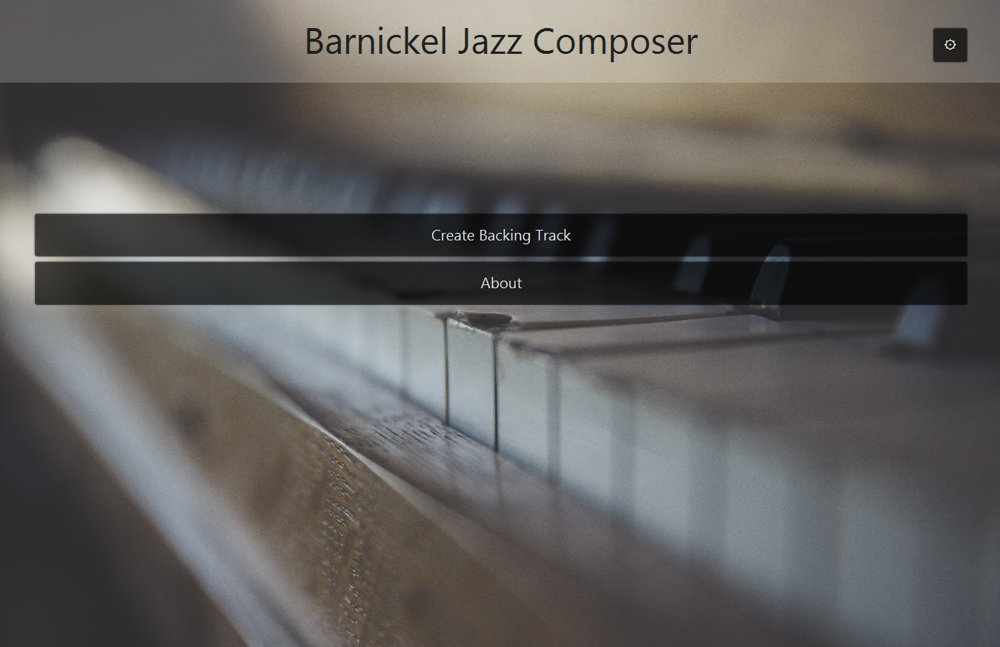
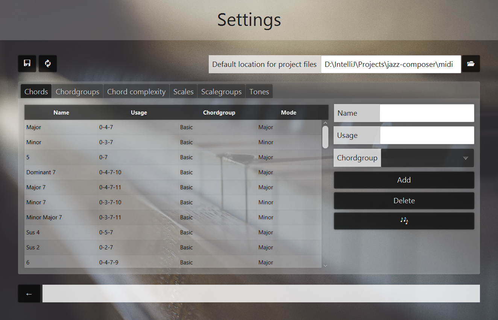
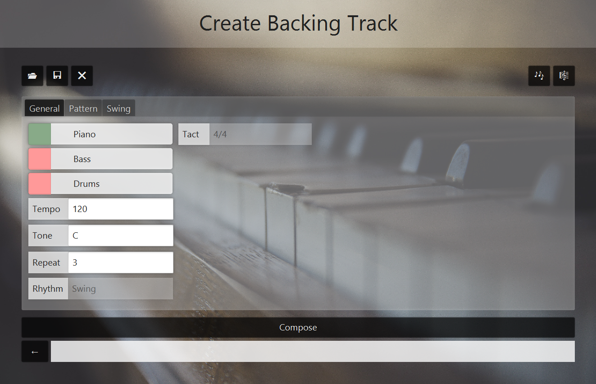
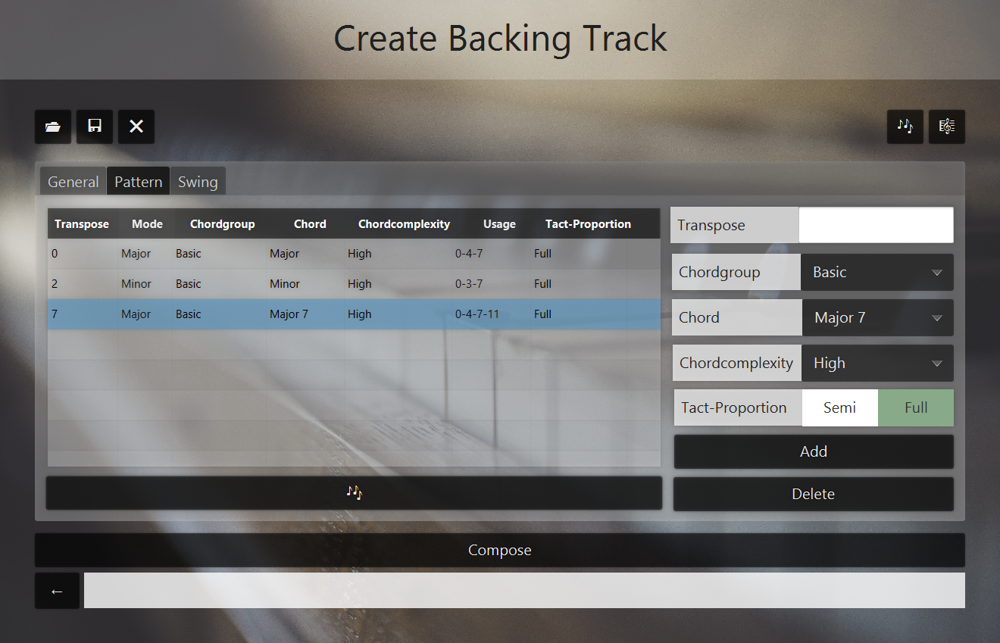

# jazz-composer
Java application to compose jazz music.

## 1. Used libraries
- [JMusic](http://explodingart.com/jmusic/)
- [JSON-Simple](https://github.com/fangyidong/json-simple)

## 2. Getting started

### 2.1 The menu

By starting the _jazz-composer_, you'll reach at first the menu. From here you have different options:
- Manage settings in `⚙`
- Create Jazz-Backingtrack in `Create Backingtrack`
- Show informations about the project in `About`

### 2.2 The settings

Manage chordgroups, scalegroups including there chords and scales. Set chordcomplexities and tones including there pitches. You can use this musicstructures for the later jazz-composing.
Save the settings by clicking on `💾` or pressing `Ctrl` + `S`.
Load the default-settings by clicking on `🔃`.
Set the default folder for project-files by clicking on `📂`.

You can play chords, scales and pitches by selecting an item in a table and click on `🎶`. Add, change and delete items.

## 3. Composing Jazz-Music

### 3.1 Create Backingtrack

Open a MIDI-File by clicking `📂`. 
Save Backingtrack as MIDI-file by clicking on `💾`. 
Clear the Backingtrack by clicking on `❌`.
Play Backingtrack by clicking on `🎶`.
View Backingtrack as *JMusi-Project* by clicking on `🎼`.

In the *General* overview you can activate or deactivate the instruments Piano, Bass and Drums. Set the tone, the tempo and the number of repetitions.
The Backingtrack will be composed in *Swing* and *4/4*-Tact.

In the *Pattern* overview you can design the pattern for the Backingtrack. Set the transpose-key, the chordgroup and the to be considered chord. 
Continue by choosing the chordcomplexity.
Set the pattern-interval to `Semi` if you want to use the patternelement in a half part of a *4/4*-Tact.
Otherwise set the pattern-interval `Full` for using the whole *4/4*-Tact. 

Create Backingtrack by clicking on `Compose`.

## 4. About

Development: Philipp Barnickel

Review: Prof. Dr. Eckhard Kruse